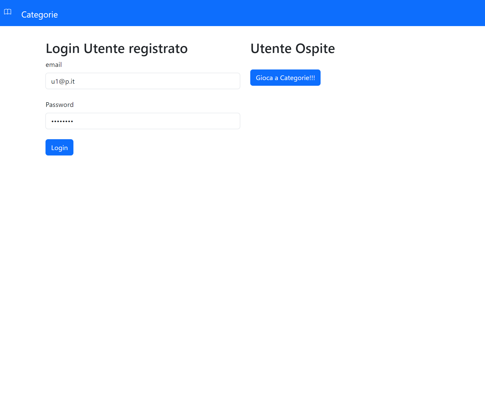
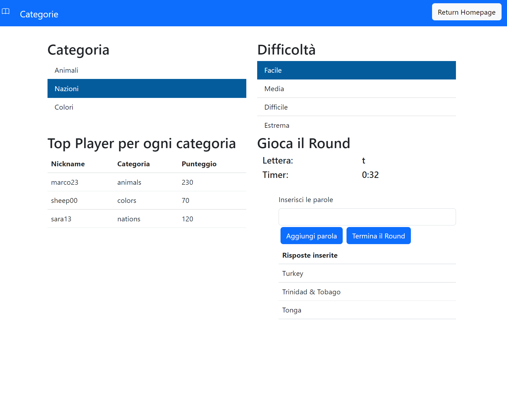
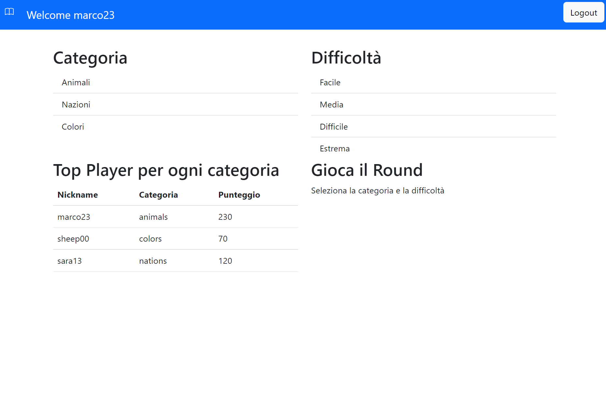
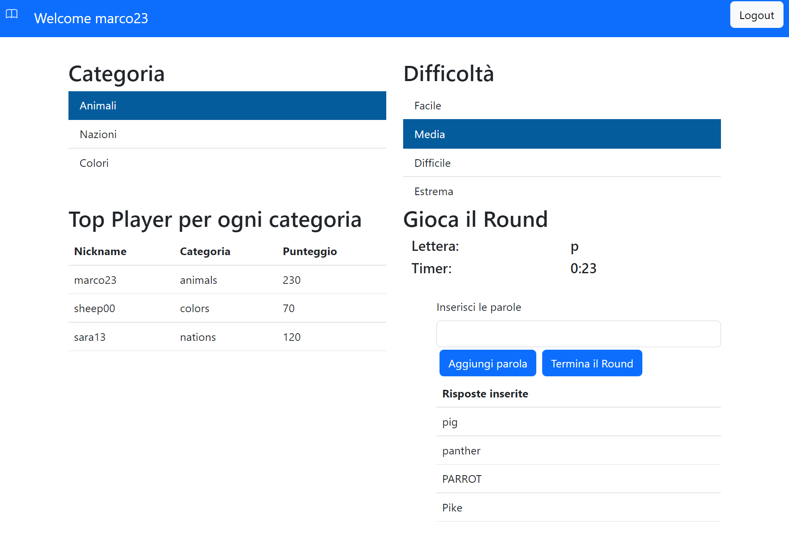
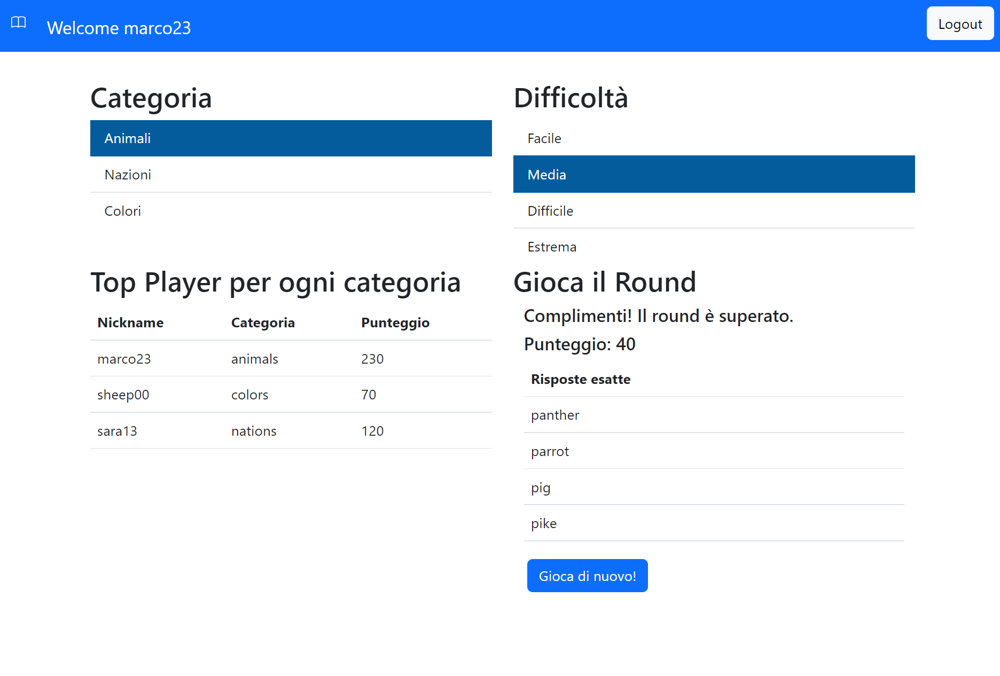

# Exam #3: "Categorie"
## Student: s303435 GRECO GABRIELE 

## React Client Application Routes

- Route `/`: route della Homepage, dove un utente può decidere se effettuare il login oppure giocare in modo anonimo
- Route `user`: route per raggiungere la pagina utente dopo aver fatto il login
- Route `/guest`: route per raggiungere la pagina utente anonimo

## API Server

- GET `/api/rankUsers`: ritorna la classifca del top player per ogni categoria
  - request parameters: _None_
  - response body content: lista della classifica del miglior utente ogni categoria {nickname, categoria, score}
  - response: `200 OK` (success) or `500 Internal Server Error` (generic error)
- POST `/api/checkAnswersGuest/:CodU/:category/:character`: inviando le risposte inserite ritorna le risposte esatte
  - request parameters: CodU, category, character
  - request body content: answers: risposte inserite dall'utente, category: categoria del round, character: lettera iniziale del round, CodU: codice utente (0 per l'utente anonimo)
  - response body content: lista delle risposte esatte: {text}
  - response: `200 OK` (success), `401 Unauthorized` (generic error), `422 Unprocessable Entity` (validation error) or `503 Service Unavailable` (generic error)
- POST `/api/checkAnswersUser/:CodU/:category/:difficulty/:character`: inviando le risposte, ritorna le risposte esatte con il relativo punteggio
  - request parameters: CodU, category, difficulty, character
  - request body content: answers: risposte inserite dall'utente, category: categoria del round, difficulty: difficoltà, character: lettera iniziale del round, CodU: codice utente, nickname: nickname dell'utente, timestamp: timestamp di inizio round
  - response body content:  lista delle risposte esatte con punteggio: {text, score}
  - response: `200 OK` (success), `401 Unauthorized` (generic error), `422 Unprocessable Entity` (validation error) or `503 Service Unavailable` (generic error)
- POST `/api/newRound`: inserimento di un nuovo round nel database
  - request parameters: _None_
  - request body content: CodU: codice utente, nickname: nickname dell'utente, character: lettera iniziale, category: cateogoria, score: punteggio totale, difficulty: difficoltà del round, answer: stringa con le risposte esatte separate da una virgola, timestamp: timestamp di inizio round
  - response body content: _None_
  - response: `200 OK` (success), `401 Unauthorized` (generic error), `422 Unprocessable Entity` (validation error) or `503 Service Unavailable` (generic error).
- POST `/api/sessions`: autentica la richiesta di login dell'utente
  - request parameters: _None_
  - request body: credenziali per il login: email e password
  - response body: informazioni dell'utente: {CodU, nickname, email}
  - response: `200 OK` (success) or `401 Unauthorized` (generic error)
- GET `/api/sessions/current`: prende la sessione utente corrente
  - request parameters: _None_
  - request Body: _None_
  - response body content: informazioni dell'utente: {CodU, nickname, email}
  - response: `200 OK` (success) or `401 Unauthorized` (generic error)
- DELETE `/api/sessions/current`: effettua il logout dell'utente cancellando la sessione corrente
  - request parameters: _None_
  - request body: _None_
  - response body: _None_
  - response: `200 OK` (success)

## Database Tables

- Table `answers` - Tabella con tutte le risposte.
- VALUES(CodA, text, category)
- CodA è la chiave primaria, settata con autoincrement nel db. Il text è la risposta esatta (può contenere anche più parole es: "Faroe Islands", "Dark pink"), category è la categoria di cui fa parte.

- Table `rounds` - Tabelle con tutti i round.
- VALUES(CodR, CodU, nickname, character, category, score, difficulty, answer, timestamp)
- CodR è la chiave primaria, settata con autoincrement nel db, CodU è una chiave esterna, indica a quale utente appartiene il round, nickname dell'utente, character è la lettera del round, score è il punteggio ottenuto nel round, difficulty la difficoltà del round, answer indica tutte le risposte esatte inserite separate da una virgola ed il timestamp è l'istante iniziale dall'inizio del round.

- Table `users` - Tabella degli utenti.
- VALUES(CodU, nickname, email, hash, salt)
- Il CodU è la chiave primaria, settata con autoincrement nel database. Il nickname verrà mostrato per identificare gli utente nell'applicazione. Email, hash e salt usati per l'autenticazione

## Main React Components

- `user` (in `App.js`): salva lo stato dell'utente
- `HomePage` (in `homePage.js`): pagina principale dove è presente il form per il login ed un tasto dove un utente può accedere in modo anonimo.
- `Intestazione` (in `intestazione.js`): in base al tipo di pagina mi gestisce un tipo diverso di intestazione (home, guest, user)
- `Timer` (in `timer.js`): componente per gestire il timer di 60, lavora sul timestamp di inizio round e su quello attuale. La useEffect viene chiamata ogni richiamata ogni secondo grazie ad un setTimeout. Alla fine del countdown setta il `stopRound` a true terminando il round ed inviando al server la richiesta per il controllo delle parole inserite.
- `ViewForm` (in `viewForm.js`): componente chiamata sia dalla pagina UserPage sia da GuestPage. In base al valore di user effettua diverse operazioni. Monta il nav per la scelta della categoria, della difficoltà, la stampa della classifica e richiama `GameForm`
- `selectedCategory` (in `viewForm.js`): stato per la attuale categoria scelta
- `selectedDifficulty` (in `viewForm.js`): stato per la attuale difficoltà scelta diviso in `d1` (livello di difficoltà) e `d2` (parole da indovinare)
- `stopRound` (in `viewForm.js`): stato che mi ferma il gioco quando termina un round o scade il timer. Il gioco rinizia quando cambio difficoltà/categoria
- `GameForm` (in `gameForm.js`): componente che gestisce tutto il round in gioco
- `correctAnswers` (in `gameForm.js`): lista delle risposte esatte
- `answersGiven` (in `gameForm.js`): lista delle risposte inserite
- `selectedCharacter` (in `gameForm.js`): carattere randomico in lowercase. Durante l'inserimento delle parole viene considerato anche il carattare in Uppercase, quindi per esempio "Italy" sarà uguale a "italy".
- `timestamp` (in `gameForm.js`): timestamp di inizio round, usato dal timer
- `useEffect` (in `gameForm.js`): ogni volta che si cambia categoria o difficoltà vengono resettati il carattere, il timestamp, le risposte inserite e giuste.
- `handleAddWord` (in `gameForm.js`): gestisce i controlli sulle parole inserite in modo tale che inizino con il carattere selezionato, non ci siano duplicati.
- `handleEndRound` (in `gameForm.js`): setta il `stopRound` a true terminando il round ed inviando al server la richiesta per il controllo delle parole inserite
- `PrintRoundPassed` (in `gameForm.js`): stampa del round superato con lista delle risposte esatte e punteggio nel caso tu sia un utente loggato
- `PrintRoundNotPassed` (in `gameForm.js`): stampa del round non superato
- `RestartButton` (in `gameForm.js`): setta il `stopRound` a false e fa riniziare il gioco

## Screenshot

## Users Credentials

- username: u1@p.it, password: password
- username: u2@p.it, password: password
- username: u3@p.it, password: password
- username: u4@p.it, password: password
